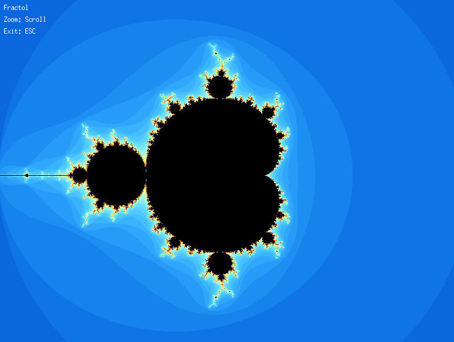
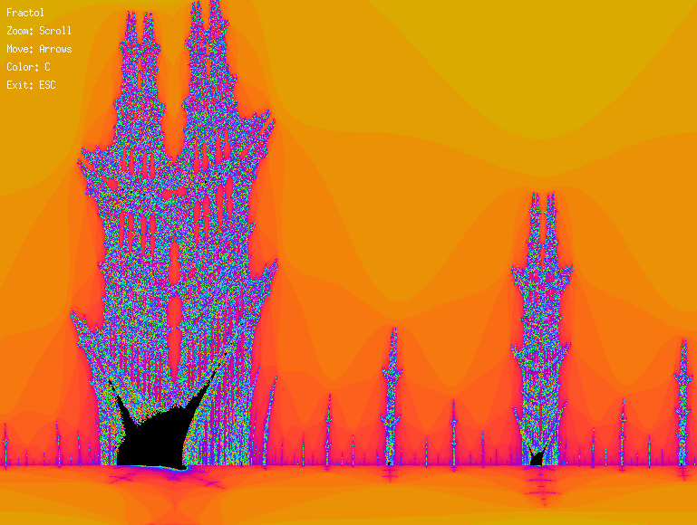

<div align="center">



[](https://forthebadge.com)

</div>

# fract-ol

Frac-ol is a 42 school project whose goal is to create a fractal explorer.

The program will display different fractals and allow the user to zoom and change the color of the fractal.

## How to use

- Clone the repository
- Install the [MiniLibX](https://github.com/42Paris/minilibx-linux)
- Run `make` to compile the executable
- Run `./fractol [fractal]` to execute the program

## Install MiniLibX

- Clone the repository with `git clone git@github.com:vcwild/fract-ol.git`
- Run `make` to compile the library need to install libbsd-dev libXext-dev
- Copy the library `libmlx.a` from the root of the home directory
- Copy the header file `mlx.h` from the root of the home directory

## Mandatory part

- [x] The project must be written in accordance with the Norm.
- [x] The executable file must be named fractol.
- [x] The project must be written in accordance with the Norm.
- [x] The executable must be able to display at least the Mandelbrot and Julia sets.
- [x] The executable must be able to zoom in and out of the fractal using the mouse wheel.

## Bonus part

- [x] The executable must be able to change the color palette with the number keys.
- [x] The executable must be able to move the fractal with the arrow keys.
- [x] The executable must be able to lock the fractal on a point with the mouse.
- [x] The exacutable must be able to display at least one other fractal of your choice.

## Example

Display the [Mandelbrot](https://en.wikipedia.org/wiki/Mandelbrot_set) set

```bash
./fractol mandelbrot
```


Display the [Julia](https://en.wikipedia.org/wiki/Julia_set) set

```bash

```bash
./fractol julia complex_number complex_number # complex_number is a float
```


Display the Burning Ship set

```bash
./fractol burningship
```



## Controls

The following controls are available for all fractals:

- [x] `ESC` : Quit the program
- [x] `R` : Reset the view
- [x] `C` : Change the color
- [x] `Mouse Wheel` : Zoom in/out
- [x] `left arrow` : Move the fractal to the left
- [x] `right arrow` : Move the fractal to the right
- [x] `up arrow` : Move the fractal up
- [x] `down arrow` : Move the fractal down
